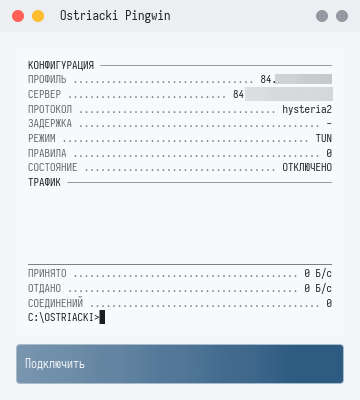
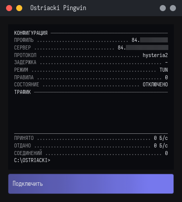
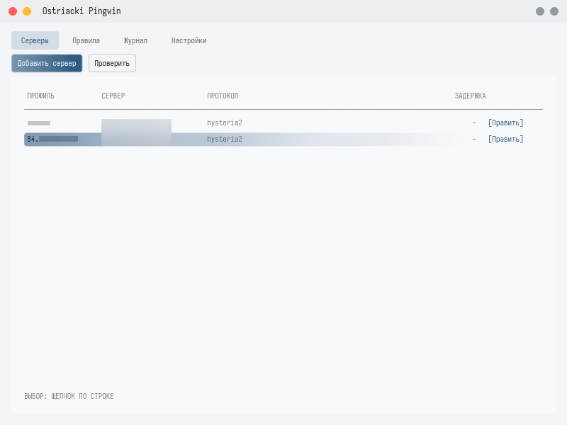
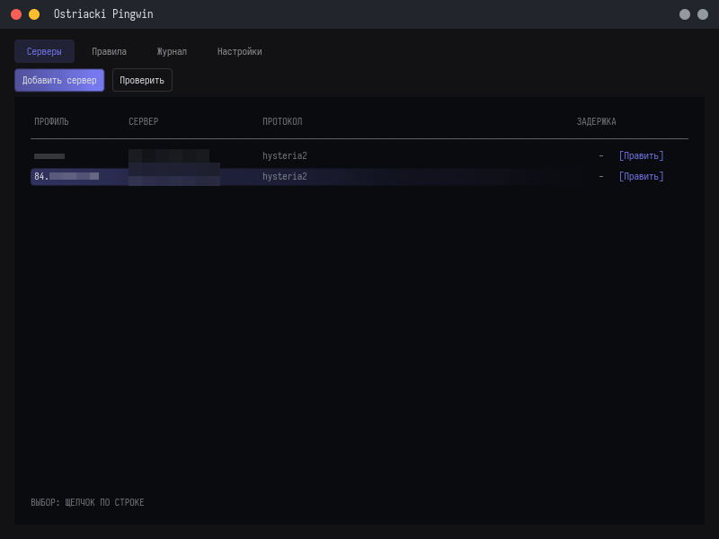

<div align="center">

<br>

# Penguin

**VPN-клиент с раздельным тоннелированием: по приложениям, по адресам и по тому и другому сразу.**

[](rust-toolchain.toml)
[](#лицензия)
[](crates/platform)
[](crates/platform)
[](crates/platform)

<br>

</div>

---

<div align="center">

<br>


&nbsp;&nbsp;&nbsp;


<br>
<br>



<br>
<br>



<br>

</div>

---

<br>

## Стек

<br>

| Слой | Чем сделано |
|---|---|
| **Язык** |   |
| **Протокол** |  |
| **Транспорт** |    |
| **Стек TCP/IP** |  |
| **Адаптер** |    |
| **Маршруты** |    |
| **Kill switch** |    |
| **DNS** |     |
| **Служба** |    |
| **Права** |    |
| **Канал управления** |    |
| **Системный слой** |    |
| **Асинхронность** |  |
| **Интерфейс** |   |
| **Платформа** |    |

<br>

---

<br>

## Что он делает

<br>

Забирает трафик машины через TUN-адаптер, узнаёт для каждого соединения
приложение-владельца и адрес назначения, а дальше по правилам решает:
**в тоннель**, **напрямую** или **оборвать**.

<br>

- **Правила по владельцу соединения** — путь, имя или шаблон пути к `.exe`.
  Владелец определяется по локальному порту средствами ОС: без своего драйвера,
  без WinDivert и без подписанных callout'ов WFP.

- **Правила по назначению** — домен, суффикс, подстрока, regex, CIDR, порт,
  диапазон портов, GeoIP, GeoSite, вид трафика. Условия складываются в
  `all` / `any` / `not`.

- **Ответ на вопрос «почему это приложение пошло не туда»** — `rules explain`
  показывает сработавшее правило и те, что сработали бы без него.

- **Свой DNS** — fake-IP, кеш, hosts, апстримы UDP / DoT / DoH.

- **Kill switch и доступ к локальной сети** — переключателями.

- **Локальный SOCKS5 и HTTP-прокси** — без прав администратора и без драйвера.

- **Окно, терминал и служба** — в одном исполняемом файле.

<br>

---

<br>

## Устройство

<br>

```
приложение → penguin-tun → penguin-netstack → penguin-router → Tunnel / Direct / Block
                              │                    ▲
                              ├── penguin-process ─┤  кто владелец: порт → pid → путь
                              ├── penguin-dns ─────┤  fake-IP → домен
                              └── engine::sniff ───┘  SNI из первых байт
```

<br>

| Каталог | Что там |
|---|---|
| `crates/` | инфраструктура клиента: транспорт, маршрутизация, DNS, демон, GUI, CLI |
| `protocols/` | реализации протоколов, по крейту на протокол |
| `vendor/rust-ui-kit` | UI-кит поверх `iced`, подключён submodule'ом |

<br>

Протокол не знает ни про TUN, ни про правила, ни про GUI — он умеет только
открыть соединение к адресу. Всё остальное описано контрактом в `penguin-proto`.

<br>

---

<br>

## Сборка

<br>

```bash
git clone --recurse-submodules git@github.com:Saviartache/penguin.git
```

```bash
cargo build --workspace
```

<br>

Уже склонированный без submodule'а чинится через
`git submodule update --init --recursive`. Кит в workspace не входит — он
отдельный репозиторий со своими правилами и проверяется своим
`vendor/rust-ui-kit/scripts/check.sh`.

<br>

---

<br>

## Запуск

<br>

```bash
cargo run -p penguin-app -- doctor
```

```bash
cargo run -p penguin-app -- rules explain steamcontent.com:443 --process steam.exe
```

<br>

`doctor` проверяет настройки, профили, правила и права. Все поля настроек с
пояснениями — в [`assets/config.example.toml`](assets/config.example.toml).

Окно поднимается через `cargo run -p penguin-app` — и это единственное, что
нужно запускать. Службу оно ставит и запускает само, а права спрашивает
системным окном: UAC на Windows, окно с отпечатком или паролем на macOS,
polkit на Linux. Команды `penguin service …` существуют для тех, кто
разбирается, почему что-то пошло не так; в обычной работе они не нужны.

<br>

---

<br>

## Документация

<br>

| Файл | О чём |
|---|---|
| [`docs/architecture.md`](docs/architecture.md) | путь одного соединения и граф зависимостей |
| [`docs/split-tunneling.md`](docs/split-tunneling.md) | как определяется владелец соединения |
| [`docs/protocols.md`](docs/protocols.md) | как добавить протокол |
| [`AGENTS.md`](AGENTS.md) | правила работы с репозиторием |

<br>

---

<br>

## Лицензия

MIT

<br>
